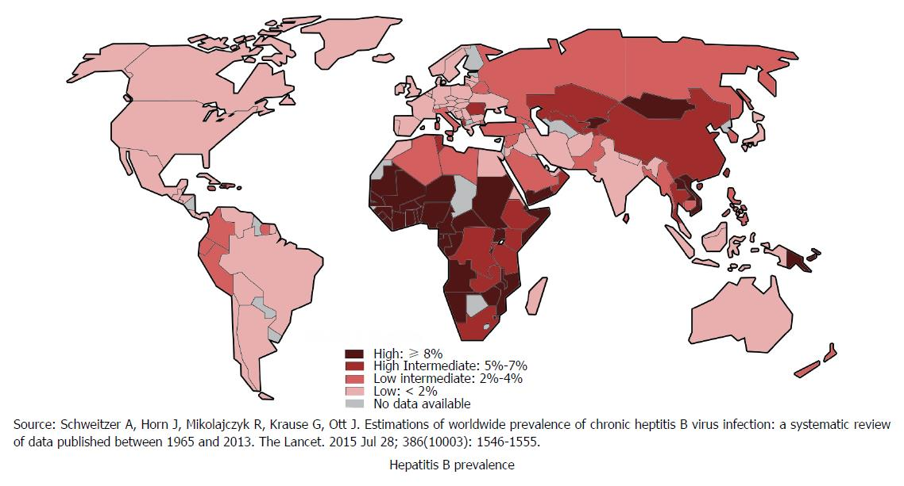

# Quanto è diffusa

[_World J Clin Cases 2018; 6(13): 589-599_](https://dx.doi.org/10.12998/wjcc.v6.i13.589)

L’epatite **B** è diffusa in tutto il mondo, causando ogni anno migliaia di morti (soprattutto a causa delle complicazioni, incluse cirrosi e cancro). Secondo i dati dell’OMS, circa 257 milioni di persone nel mondo sono affette da epatite B cronica.

## Mondiale

L’epatite B è presente in modo diffuso in tutto il mondo: circa 1/3 della popolazione mondiale è stata esposta al virus e circa 257 milioni di persone sono affette da epatite B cronica. Nel 2015 (ultimo dato disponibile) sono morte circa 887.000 persone per malattie correlate all'epatite B.

## Italia

In Europa ci sono circa 4,7 casi ogni 100.000 abitanti. In Italia, negli ultimi 30 anni, le infezioni da epatite B sono diminuite sia per il miglioramento delle condizioni socio-economiche, sia grazie alla vaccinazione anti-epatite B iniziata nel negli anni 80 e diventata **obbligatoria dal 1991**. Tuttavia, vi sono ancora circa 600.000 portatori di infezione cronica, con malattie del fegato correlate all’epatite B.
