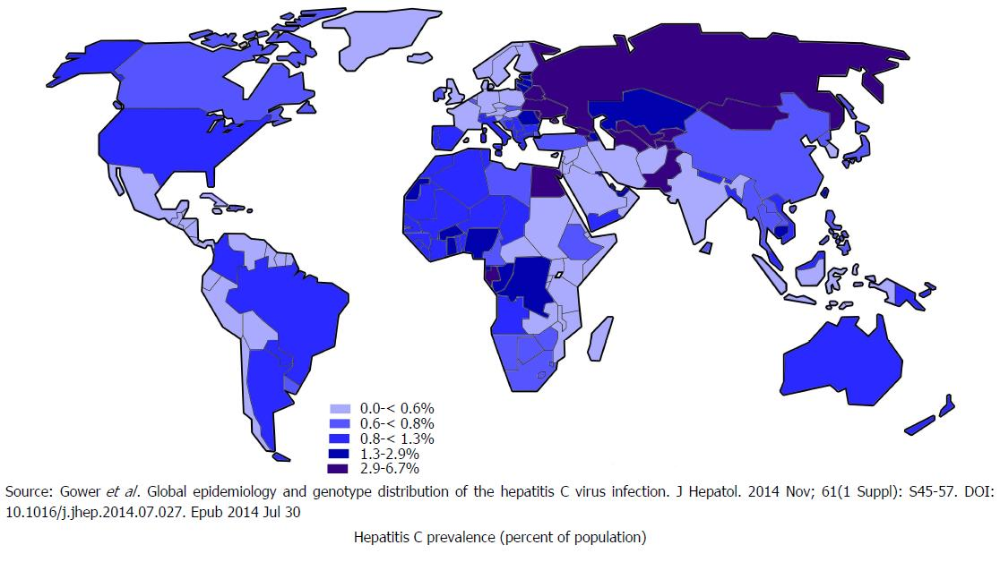

# Quanto è diffusa

[_World J Clin Cases 2018; 6(13): 589-599_](https://dx.doi.org/10.12998/wjcc.v6.i13.589)

## Mondo

L’epatite **C** è diffusa in tutto il mondo. I paesi con i tassi più alti di infezioni croniche sono i paesi con basso standard socio-sanitari dove spesso l’infezione è ancora associate alle cure. La sua distribuzione geografica varia considerevolmente: l'Africa e l'Asia sono le aree di maggiore prevalenza, mentre in America, Europa occidentale e settentrionale e Australia la malattia è meno presente.

Secondo stime dell'[Organizzazione Mondiale della Sanità](https://it.wikipedia.org/wiki/Organizzazione_mondiale_della_sanit%C3%A0) (OMS) il 2-3% della popolazione mondiale ha avuto contatto con il virus dell’epatite **C** nel corso della vita per un totale di 120-170 milioni di persone (di cui 71 milioni hanno l’infezione cronica). Inoltre, circa 71 milioni di persone nel mondo sono affette da _epatite C cronica_. Ogni anno si verificano 3-4 milioni di nuovi casi e muoiono circa 400.000 persone a causa di patologie del fegato correlate all’epatite C (soprattutto cirrosi e cancro).

Questi dati sono probabilmente sottostimati, dato che l'epatite C spesso non provoca sintomi per molti anni e le persone non si accorgono di averla presa. Le persone più a rischio hanno tra 25 e 44 anni, e sono soprattutto uomini. Nei paesi ad elevati standard socio-sanitari l’ottimizzazione dei percorsi assistenziali e dei percorsi di donazione di organi e tessuti minimizzato il rischio di epatite **C** associato a procedure cliniche invasive, che tuttavia resta alto in contesti geografici a bassa disponibilità di risorse economiche.

::: danger
L’uso di sostanze stupefacenti, specie per via endovenosa resta la maggior causa di infezione a livello globale (sia nei paesi ricchi che nei paesi poveri).
:::

## Europa

In Europa l'incidenza di nuove diagnosi è di circa 7.3 casi ogni 100.000 abitanti (dato per il 2017 dell’ECDC). Negli ultimi 20 anni il numero totale dei casi diagnosticati nell'UE è cresciuto verosimilmente anche a seguito della maggiore consapevolezza e della disponibilità di farmaci in grado di curare l’infezione.

Oggi le droghe per via endovenosa sono il principale fattore di rischio per la trasmissione dell’epatite C in Europa.

## Italia

_"In Italia, nell'arco degli ultimi 20 anni, la diffusione dell'infezione da HCV si è molto ridotta. Attualmente si verificano ogni anno circa 100 nuovi casi (incidenza) di epatite acuta che provoca disturbi (forma clinicamente evidente o sintomatica) mentre non è precisamente nota la percentuale della popolazione italiana (prevalenza) che ha una infezione persistente (cronica). Si ritiene, tuttavia, che tale percentuale sia superiore al 3% nelle persone nate prima del 1950, e aumenti progressivamente con l'età, ma sia considerevolmente più bassa nelle generazioni più giovani. Inoltre, la diffusione (prevalenza) della malattia è più alta nel sud Italia e nelle isole rispetto alle regioni centro-settentrionali."_
[vedi ISS Salute](https://www.issalute.it/index.php/la-salute-dalla-a-alla-z-menu/e/epatite-c)
