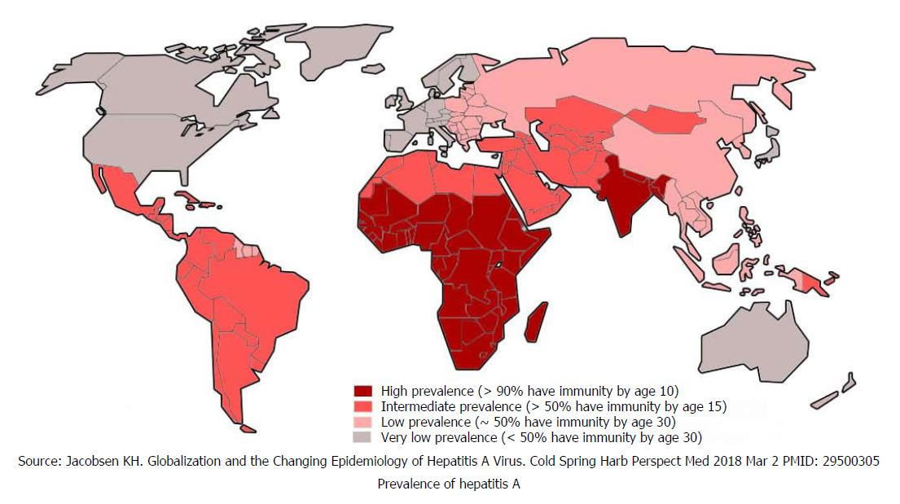

## Epatite A

::: tip Epatite A <Badge text="A-limentare" type="tip"/>
Questa malattia si trasmette tipicamente attraverso acqua contaminata con il virus _Hepatovirus A_ (**HVA**).
:::
Specialmente nei paesi più poveri, se non ci sono fognature adeguate è possibile che l'acqua per lavare il cibo o bere sia contaminata.
Si può essere infettati anche per contatti molto stretti con persone che hanno un'infezione acuta in corso.

::: warning Consigli per chi viaggia in paesi esotici

- esiste un vaccino anti-epatite **A**
- non consumare frutti di mare crudi (cozze, vongole, telline, ecc.)
- lavare accuratamente con acqua pulita (o disinfettata) le verdure prima di mangiarle
- lavare e sbucciare la frutta
- non bere acqua che potrebbe essere contaminata (per esempio acqua di pozzo)
- lavarsi con cura le mani prima di cucinare o toccare cibi e bevande
- proteggere gli alimenti dagli insetti

  :::

## Dove è più frequente

_[*World J Clin Cases 2018; 6(13): 589-599*](https://dx.doi.org/10.12998/wjcc.v6.i13.589)_
