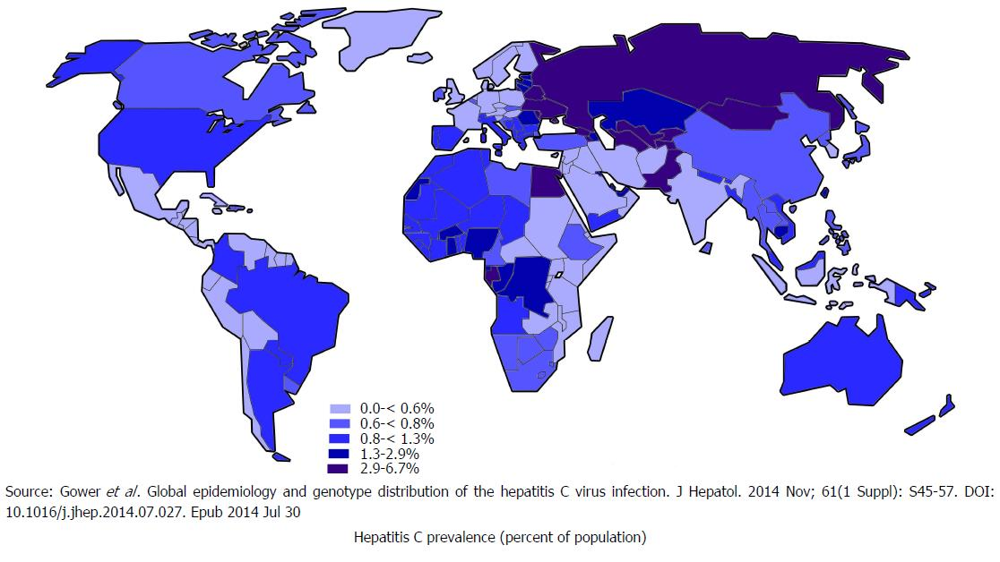

## Epatite C

::: tip Epatite C <Badge text="C-ontatto sangue" type="tip"/>

- i tossicodipendenti sono particolarmente a rischio
  :::

::: warning

- Non essiste un vaccino per l'epatite **C**
- ma si può curare
  :::

::: tip Usare il buon senso

- non utilizzare siringhe già usate
- evitare lo scambio di oggetti personali come spazzolino da denti, forbicine, rasoi, tagliaunghie, ecc.
- in caso di tatuaggi, fori alle orecchie/piercing e pratiche estetiche che prevedono l’uso di aghi/forbici/ecc.:
  - pretendere l’uso di strumenti usa e getta
  - buone condizioni igieniche dei locali in cui vengono eseguiti

:::

## Dove è più frequente

[_World J Clin Cases 2018; 6(13): 589-599_](https://dx.doi.org/10.12998/wjcc.v6.i13.589)
