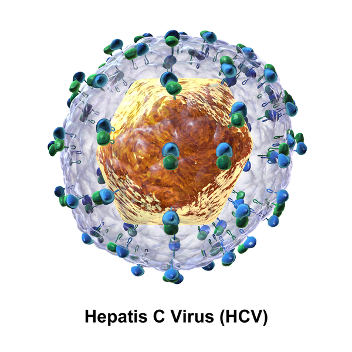

## Epatiti virali

Le Epatiti virali sono causate da virus che attacano il fegato, causando l'infimmazione chiamata epatite.

I **virus** sono dei microorganismi estremamente piccoli, visibili solo al microscopio elettronico. Sono fatti di DNA (o RNA) racchiuso in un involucro di lipidi (grassi). Per replicarsi hanno bisogno di un ospite - che potresti essere tu. Non sono batteri. I batteri sono molto più grandi dei virus.

I virus si trasmettono da ospite a ospite in vari modi che dipendono dal virus stesso.

::: tip ABC Epatite App
Qui scopriamo di più sull'epatite virale **A** **B** **C**
:::

## Epatite A

::: tip Epatite A <Badge text="A-limentare" type="tip"/>
Questo virus si trasmette tipicamente attraverso acqua contaminata che porta il virus.
:::
Specilamente nei paesi più poveri, se non ci sono fognature adeguate è possibile che l'acqua per lavare o bere sia contaminata.
Si può essere infettati anche per contatti molto stretti con persone che hanno un'infezione acuta in corso.

::: warning Per chi viaggia

- Esiste un vaccino anti-epatite **A**
  :::

## Epatite B

::: tip Epatite B <Badge text="B-io liquidi" type="tip"/>

- In italia i nati dal 1979 in poi devono essere vaccinati con l'anti-epatite **B**.

- Il virus si trasmette soprattutto attraverso liquidi Biologici.
  :::
  

## Epatite C

::: tip Epatite C <Badge text="C-ontatto sangue" type="tip"/>

- i tossicodipendenti solo particolarmente a rischio
  :::

::: warning

- Non essiste un vaccino per l'epatite **C**
- ma si può curare
  :::
